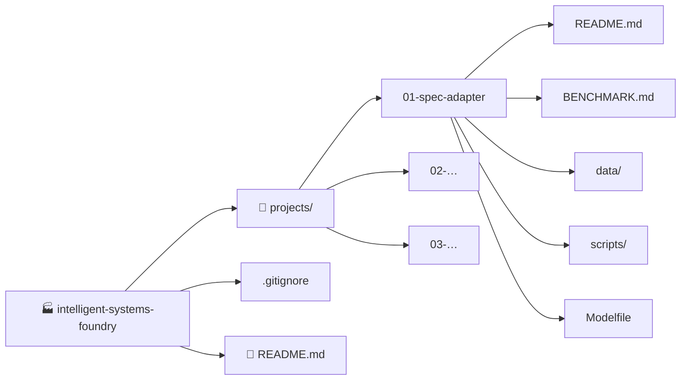

<div align="center">

# 🏭 Intelligent Systems Foundry

### Where AI agents, RAG pipelines, and fine-tuned LLMs get forged into tools that actually ship.


[🗂️ Projects](#️-the-project-board) · [🧭 Map](#-how-the-foundry-is-organized) · [🧰 Stack](#-the-toolbox) · [➕ Add a Project](#-adding-a-new-project) · [🛣️ Roadmap](#️-roadmap) · [📬 Connect](#-connect)

</div>

---

## 👋 What is this?

The Foundry is a **monorepo of hands-on AI engineering projects**. Each one is a self-contained build with its own README, data, scripts, and benchmarks. The common thread:

- 🎯 **Domain-first.** Models and agents shaped around real engineering problems, not generic demos.
- 🧪 **Measured.** Every project ships with before/after benchmarks, not vibes.
- 💻 **Local-first.** If it can run on a laptop with Ollama, it should.
- 🧱 **Structured output.** Typed JSON and deterministic pipelines over free-form text.

---

## 🗂️ The Project Board

Click a card to expand it. New projects get a new row and a new card.

| # | Project | What it does | Tech | Status |
| :-: | :--- | :--- | :--- | :-: |
| 01 | [**Spec-Adapter**](./projects/01-spec-adapter) | Domain-tuned LLM for HVAC/R catalog extraction, compressor sizing, and electrical protection | Qwen2.5-3B · LoRA · GGUF · Ollama | ✅ Shipped |
| 02 | _Coming soon_ | | | 🔜 Planned |
| 03 | _Coming soon_ | | | 🔜 Planned |

**Legend:** ✅ Shipped · 🚧 In progress · 🔜 Planned · 🧊 Paused

<details open>
<summary><b>⚙️ 01 · Spec-Adapter</b> — a model that never guesses a breaker size</summary>

<br>

A parameter-efficient fine-tune of Qwen2.5-3B-Instruct that turns messy catalog and sizing questions into strict, typed JSON.

| Metric | Baseline | Fine-tuned |
| :--- | :--- | :--- |
| Electrical safety | ❌ Hallucinated 600 A breaker for a ~15 A load | ✅ Grounded in verified LRA |
| Latency | 11.61 s | **6.66 s** (42.6% faster) |
| Output | Markdown + stringified units | Flat JSON, native numbers |

```bash
ollama run spec-adapter "Deconstruct Copeland model number: ZP54K5E-TF5-830"
```

**👉 [Read the full project README](./projects/01-spec-adapter/README.md)** · [Benchmarks](./projects/01-spec-adapter/BENCHMARK.md)

</details>

<details>
<summary><b>🔜 02 · Next project</b></summary>

<br>

_Placeholder. Copy the [card template](#-adding-a-new-project) below when you start it._

</details>

---

## 🧭 How the Foundry Is Organized



```text
intelligent-systems-foundry/
├── README.md                 # You are here
├── .gitignore
└── projects/
    ├── 01-spec-adapter/      # Domain-tuned HVAC/R model
    ├── 02-…/
    └── 03-…/
```

**Convention:** every project lives in `projects/NN-short-name/`, runs on its own, and documents itself.

---

## 🧰 The Toolbox

<details>
<summary><b>🧠 AI &amp; ML</b></summary>

<br>


LoRA / QLoRA fine-tuning · GGUF quantization · RAG pipelines · agent workflows

</details>

<details>
<summary><b>🖥️ Application layer</b></summary>

<br>


</details>

<details>
<summary><b>☁️ Cloud &amp; infra</b></summary>

<br>


</details>

---

## ➕ Adding a New Project

<details>
<summary><b>📋 Step-by-step checklist</b></summary>

<br>

- [ ] Create `projects/NN-short-name/` with its own `README.md`
- [ ] Include a quick-start that works in under 5 minutes
- [ ] Add benchmarks or a demo output
- [ ] Add a row to [The Project Board](#️-the-project-board)
- [ ] Add a collapsible card (template below)
- [ ] Bump the **Projects** badge count at the top

</details>

<details>
<summary><b>🧩 Copy-paste card template</b></summary>

<br>

````markdown
| NN | [**Project Name**](./projects/NN-short-name) | One-line description | Tech · Tech · Tech | 🚧 In progress |

<details>
<summary><b>🔧 NN · Project Name</b> — tagline</summary>

<br>

Two sentences on what it does and why it matters.

| Metric | Before | After |
| :--- | :--- | :--- |
| … | … | … |

```bash
# the one command that shows it working
```

**👉 [Read the full project README](./projects/NN-short-name/README.md)**

</details>
````

</details>

---

## 🛣️ Roadmap

- [x] 01 · Spec-Adapter, domain-tuned model for HVAC/R
- [ ] Next: more fine-tuning recipes and dataset builders
- [ ] Next: agent and RAG reference builds
- [ ] Next: open-source alternatives to paid dev tools
- [ ] Shared evaluation harness reused across projects

> 💡 Have an idea or found a bug? [Open an issue](../../issues).

---

## 📬 Connect

[](https://github.com/Santosh03G)
[](https://linkedin.com/in/santosh-g-03/)

---

<div align="center">

**Forged, measured, and shipped.** 🔥

⭐ Star the repo to follow along as new projects land.

[⬆ Back to top](#-intelligent-systems-foundry)

</div>
