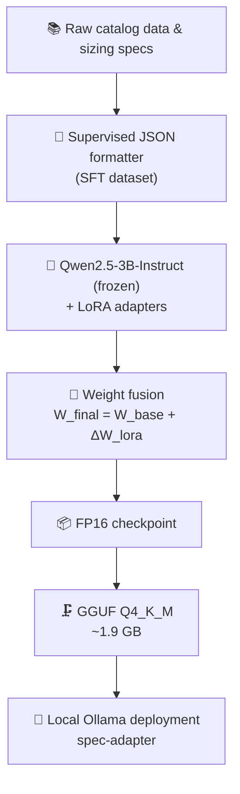

<div align="center">

# ⚙️ Spec-Adapter

### A domain-adapted LLM that speaks fluent HVAC/R — and never guesses a breaker size.

[](https://huggingface.co/Qwen/Qwen2.5-3B-Instruct)
[-brightgreen?style=for-the-badge)](#-how-its-built)
[](#-run-it-locally-in-60-seconds)
[](https://ollama.com)
[](LICENSE)

**Catalog extraction · Compressor sizing · Branch-circuit protection · Strict JSON out**

[🔥 The Problem](#-the-problem) · [📊 Benchmarks](#-benchmarks-at-a-glance) · [🧪 Live Demos](#-live-demos) · [🛠️ How It's Built](#-how-its-built) · [🚀 Quickstart](#-run-it-locally-in-60-seconds) · [❓ FAQ](#-faq)

</div>

---

## 🔥 The Problem

Ask a generic LLM to size circuit protection for a compressor and it will answer confidently, fluently, and **dangerously wrong**.

> 🚨 A **600 A** breaker on a **~15 A** load isn't a rounding error. It's a fire hazard.

Spec-Adapter is a parameter-efficient fine-tune of Qwen2.5-3B-Instruct on Copeland HVAC/R catalog and sizing data. It:

- ✅ **Grounds** every answer in real catalog values (e.g. verified Locked Rotor Amps)
- ✅ **Constrains** output to typed, deterministic JSON, ready for ERP/CAD ingestion
- ✅ **Runs on a laptop**, fully offline, in ~1.9 GB

---

## 📊 Benchmarks at a Glance

| Metric | 🤖 Baseline (Qwen2.5-3B-Instruct) | 🎯 Spec-Adapter (Fine-Tuned) | Impact |
| :--- | :--- | :--- | :--- |
| **Electrical safety** | ❌ Hallucinates a 600 A breaker for a ~15 A load | ✅ Returns exact LRA (**127.0 A**) and phase splits | Prevents catastrophic fire hazards |
| **Catalog accuracy** | ❌ Invents a model (`CPH150SACV`) | ✅ Correct A2L architecture (`YAS147KCE`) | Real BOM and refrigerant-code compliance |
| **Inference latency** | 11.61 s (212 tokens) | **6.66 s (127 tokens)** | ⚡ **42.6% faster** end-to-end |
| **Downstream ingestion** | Markdown-wrapped, stringified units | Flat JSON with native floats and ints | 🧹 Zero-regex parsing |

**Latency, visualised** (shorter is better):

```text
Baseline      ████████████████████████  11.61 s
Spec-Adapter  ██████████████             6.66 s   ← 42.6% faster
```

> 📎 Full evaluation across every test case: **[BENCHMARK.md](./BENCHMARK.md)**

---

## 🧪 Live Demos

Click to expand each case and see real model output side by side.

<details open>
<summary><b>⚡ Demo 1 — Electrical sizing &amp; safety metrics</b></summary>

<br>

**Prompt**

```text
Calculate electrical safety metrics and circuit protection requirements for
Compressor Model: YA147K1E-TFD-ERZ | Electrical System: 460/380-420 V, 3-Phase, 50/60 Hz
```

<table>
<tr>
<th width="50%">🤖 Baseline: generic hallucination</th>
<th width="50%">🎯 Spec-Adapter: deterministic &amp; safe</th>
</tr>
<tr>
<td>

```json
{
  "CompressorModel": "YA147K1E-TFD-ERZ",
  "SafetyMetrics": {
    "ShortCircuitProtection": { "MinimumRating": "600 A" },
    "GroundFaultProtection":  { "MinimumRating": "125 A" },
    "OverloadProtection":     { "MinimumRating": "150 A" }
  }
}
```

</td>
<td>

```json
{
  "compressor_model": "YA147K1E-TFD-ERZ",
  "l1_voltage": 460.0,
  "l2_voltage": 380.0,
  "l3_voltage": 420.0,
  "phase_count": 3,
  "operating_frequency": 50.0,
  "mcc_standard": "YAS147K1E-TFD-ERZ",
  "lra_amps": 127.0,
  "sizing_compliance": "YES"
}
```

</td>
</tr>
</table>

> ❌ **Critical defect:** a 600 A breaker on a 15–20 A full-load circuit is an electrical hazard.
> ✅ **Grounded:** matches verified Locked Rotor Amperes (127.0 A) and resolves voltage bounds into numeric floats.

</details>

<details>
<summary><b>🎯 Demo 2 — Pick a compressor from requirements</b></summary>

<br>

**Prompt**

```text
Select the appropriate Copeland compressor model matching the required cooling capacity,
refrigerant specification, and electrical supply. Return performance metrics in structured JSON.

Design Requirements: Capacity Target = ~147,000 BTU/hr | Refrigerant = R-454B |
Application = Air Conditioning | Electrical = 460/380-420 V, 3 Ph, 50/60 Hz
```

**Spec-Adapter output**

```json
{
  "selected_model": "YAS147KCE-TFD-GBP",
  "compressor_type": "Scroll (Two-Stage A2L)",
  "refrigerant": "R-454B",
  "nominal_capacity_btu_hr": 147000,
  "input_power_watts": 119400,
  "eer_btu_wh": 1.24,
  "mass_flow_lbs_hr": 1450,
  "displacement_cfm": 52.0,
  "rated_current_amps": 24.0
}
```

</details>

<details>
<summary><b>🔬 Demo 3 — Decode a model number</b></summary>

<br>

**Prompt**

```text
Deconstruct the Copeland compressor model number into engineering specifications: ZP54K5E-TF5-830
```

**Spec-Adapter output**

```json
{
  "deconstructed_model": "ZP54K5E-TF5-830",
  "compressor_series": "ZP",
  "compression_technology": "Scroll",
  "application_domain": "Air Conditioning",
  "nominal_capacity_btu": 54000,
  "refrigerant_compatibility": "R-410A",
  "motor_voltage_amps_frequency": "208/230 V, 3-Phase, 60 Hz",
  "bill_of_materials": "830"
}
```

</details>

---

## 🛠️ How It's Built



<details>
<summary><b>🧠 Parameter-efficient training</b></summary>

LoRA (`r=16`, `α=32`) on the **query, key, value and output projection** layers. Only the small adapter matrices train, which keeps active memory **under 8 GB VRAM**.

</details>

<details>
<summary><b>🔗 Weight fusion</b></summary>

The trained adapter is merged into the base model's FP16 layers (`W_final = W_base + ΔW_lora`), so there is **no adapter overhead at runtime**.

</details>

<details>
<summary><b>🗜️ Quantization</b></summary>

The merged checkpoint is converted to **GGUF Q4_K_M** (4-bit, medium), preserving domain benchmark accuracy while fitting on laptops and edge devices.

</details>

---

## 🚀 Run It Locally in 60 Seconds

**Prerequisites:** [Ollama](https://ollama.com) installed · at least **2.5 GB** free RAM/VRAM

### Step 1 · Get the weights

Place the quantized file here:

```powershell
projects/01-spec-adapter/models/spec_adapter_qwen3b_q4_k_m.gguf
```

### Step 2 · Build the model

From `projects/01-spec-adapter/`:

```powershell
ollama create spec-adapter -f ./Modelfile
```

### Step 3 · Talk to it

<details open>
<summary><b>💬 CLI</b></summary>

```powershell
ollama run spec-adapter "Calculate electrical safety metrics for Compressor Model: YA147K1E-TFD-ERZ | 460V 3Ph 60Hz"
```

</details>

<details>
<summary><b>🌐 REST API</b></summary>

```bash
curl http://localhost:11434/api/generate -d '{
  "model": "spec-adapter",
  "prompt": "Deconstruct Copeland model number: ZP54K5E-TF5-830",
  "stream": false,
  "format": "json"
}'
```

</details>

<details>
<summary><b>🐍 Python</b></summary>

```python
import json, requests

resp = requests.post(
    "http://localhost:11434/api/generate",
    json={
        "model": "spec-adapter",
        "prompt": "Deconstruct Copeland model number: ZP54K5E-TF5-830",
        "stream": False,
        "format": "json",
    },
    timeout=60,
)
spec = json.loads(resp.json()["response"])   # native floats & ints, no regex
print(spec["nominal_capacity_btu"])          # 54000
```

</details>

---

## 🧪 Reproduce the Benchmarks

[](https://colab.research.google.com/github/Santosh03G/YOUR_REPO/blob/main/projects/01-spec-adapter/scripts/benchmark_colab.py)

```bash
python scripts/benchmark_colab.py
```

Both the base model and the fine-tuned checkpoint run over **identical prompts** with deterministic decoding (`temperature=0.1`). Results land in `benchmark_results.json`.

---

## 📂 Repository Map

```text
projects/01-spec-adapter/
├── README.md                # You are here
├── BENCHMARK.md             # Empirical before/after report
├── benchmark_results.json   # Machine-readable evaluation logs
├── Modelfile                # Ollama build configuration
├── data/
│   ├── train.jsonl          # Domain training pairs
│   └── val.jsonl            # Validation holdout set
└── scripts/
    ├── benchmark_colab.py   # Side-by-side evaluation runner
    └── export_gguf.sh       # llama.cpp conversion script
```

---

## ❓ FAQ

<details>
<summary><b>Why a 3B model instead of something bigger?</b></summary>

The task is narrow and structured. A small model fine-tuned on in-domain data beats a large generic one on accuracy here, and it runs offline on a laptop with ~1.9 GB of weights.

</details>

<details>
<summary><b>Can I trust the electrical numbers for a real installation?</b></summary>

Treat outputs as engineering **assistance**, not a replacement for manufacturer documentation, applicable electrical codes, and a qualified engineer's sign-off.

</details>

<details>
<summary><b>Why strict JSON?</b></summary>

So output feeds ERP/CAD pipelines directly: native floats and ints, flat keys, no markdown wrappers, no unit strings to parse.

</details>

---

<div align="center">

**Built for engineers who need answers they can ship.** ⚙️

[⬆ Back to top](#️-spec-adapter)

</div>
